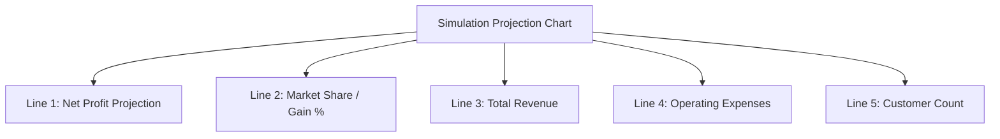

# Proposal: SME Onboarding Questionnaire & Simulation Config

This proposal details the updated onboarding structured questions, competitor profiles, and the 5-line toggleable simulation projection chart mapping profits and market gain.

---

## 1. Onboarding Competitor Profiles (Rival Shop Data)

If the user adds **Rival Shops (Competitors)**, the simulation requires competitor data to model their impact. We will suggest/assign profiles for each rival shop:

### Competitor Data Profiles (Multiple-Choice during onboarding):
* **Rival Pricing Strategy**:
  1. *Discount Leader* (Sells at 10% lower price than us)
  2. *Market Matcher* (Sells at the same price as us)
  3. *Premium Brand* (Sells at 15% higher price than us)
* **Rival Target Audience**:
  1. *SMB Retailers / Local Shops*
  2. *Wholesale Buyers / Large volume traders*
  3. *Online Consumers / Direct buyers*

*Note: If the user skips this details step, the system defaults to assigning them as a **Market Matcher** selling to **Local Shops**.*

---

## 2. Multi-Line Simulation Chart (5 Toggleable Lines)

On the simulation results page, we will add a Projection Chart showing **market gain and profits**. This chart will support **at least 5 toggle lines** that the user can check/uncheck to compare outcomes:

### Description of the 5 Toggleable Lines:
1. 📈 **Net Profit Projection** (အသားတင်အမြတ်) - Shows estimated cash profit remaining after expenses under the selected scenario.
2. 📊 **Market Share / Gain %** (ဈေးကွက်ဝေစု) - Shows the percentage of target local merchants buying from the user vs. competitors.
3. 💰 **Total Revenue** (စုစုပေါင်းဝင်ငွေ) - Projects gross sales/income.
4. 📉 **Operating Expenses** (စုစုပေါင်းကုန်ကျစရိတ်) - Displays cost projections including suppliers, rent, and overheads.
5. 👥 **Customer Count** (ဖောက်သည်အရေအတွက်) - Shows active customer volume.

*UX Control: Planners can toggle these 5 lines on/off using checkboxes below the chart to cleanly overlay profit trends and market gains.*

---

## 3. Updated Onboarding Questionnaire Sequence

1. **Product**: "What product do you sell?"
2. **POS Status**: "Do you use a POS system?" (Yes / No)
3. **Sales Data Check**: "What sales records do you keep track of?" (Daily, Weekly, Monthly, Yearly)
4. **Sales Inputs (Dynamic)**: Ask values only for selected periods.
5. **Outcomes / Expenses**: "What are your main monthly expenses (e.g. rent, salaries, supplier costs)?" (To calculate Net Profit).
6. **Rival Shops**: "Who are your main rival shops (competitors)?" (Optional).
7. **Rival Details (Dynamic if Rivals exist)**:
   - "How do they price compared to you?" (Discount / Matcher / Premium)
   - "Who are their main customers?" (Retailers / Wholesalers / Consumers)
8. **Simulation Target**: "What scenario do you want to simulate?" (Price War, Credit Demand, Supply Inflation, Other)
9. **Expected Results (SME-friendly Vocab)**: "What do you expect to see?" (Sales Drop, Less Profit, Supplier Cost Increase, Other)
