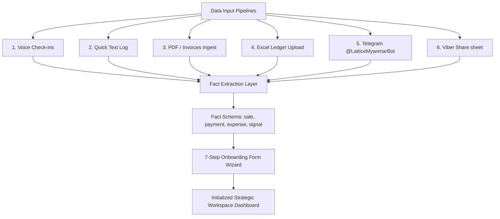

# Strategic Planner — Onboarding & Data Input Workflow Specification

This document details the unified data input pipelines, structured onboarding wizard questionnaire, and real-time state engine in the Lattice strategic workspace.

---

## 1. Data Input Architecture Overview

Lattice ingests data from six input channels, normalizing entries into a unified temporal knowledge model. The onboarding workflow facilitates both manual input and file-based context loading to configure this model.



---

## 2. Ingest Pipelines & Fact Schemas

When files (spreadsheets, invoices) are uploaded on the onboarding page, they flow through the **Fact Extraction Layer**:

* **PDF Ingest**: Scans supplier invoices, extracts vendors (suppliers), line items, total cash amount, and timestamps.
* **Excel Ingest**: Parses sales history ledgers and uses schema mapping to reconcile date formats and currency column names.
* **Voice/Telegram/Viber**: Captures natural language records, parses counterparties, sold quantity, unit types, and amounts, converting them into facts.

### The Normalization Fact Schema:
```json
{
  "type": "sale | expense | payment_received | inventory_change | market_signal",
  "amount": 1200000, 
  "counterparty": "ဦးအောင်ကျော်", 
  "product": "ဆန်", 
  "quantity": 20,
  "unit": "အိတ်",
  "occurredAt": "2026-05-28T10:00:00Z",
  "confidence": 0.95
}
```

---

## 3. The 7-Stage Onboarding Questionnaire Sequence

For users manually configuring their workspace (or validating pre-filled details extracted from uploaded files), the application renders a structured Form Wizard questionnaire. **Note: Simulation Scenario and Expected Result questions are deferred and configured dynamically on the Analytics view.**

| Step | Topic | Input Type | Description |
|---|---|---|---|
| **1** | **Product (ထုတ်ကုန်)** | Card Chips / Text Input | Sets primary selling categories (e.g. Clothing, Groceries). |
| **2** | **POS Status (POS စနစ်)** | Toggle Cards (Yes / No) | Identifies if the business uses software-based sales records. |
| **3** | **Sales Periods (အရောင်းမှတ်တမ်း)** | Multi-select Checkboxes | Defines active periods recorded (Daily, Weekly, Monthly, Yearly). |
| **4** | **Sales Values (အရောင်းပမာဏ)** | Numeric Input (per period) | Gathers estimated sales values for selected periods. |
| **5** | **Expenses (လစဉ်အသုံးစရိတ်)** | Numeric Input | Collects monthly rent, salaries, and supply overheads. |
| **6** | **Rival Shops (ပြိုင်ဘက်ဆိုင်များ)** | Text (Commas separated) | Gathers competitor names. Skips Step 7 if "None". |
| **7** | **Rival Details (ပြိုင်ဘက်အချက်အလက်)** | Grid Selection (per rival) | Sets rival pricing (Discount / Matcher / Premium) and target audience. |

---

## 4. Real-Time State Bindings

During the onboarding session, the layout is organized into a side-by-side split screen:
1. **Left Panel (Profile Status Card)**:
   - Evaluates active state bindings in real time.
   - Shows the user how their profile is building up (Product name, POS status, expenses, and competitor lists) as they answer the wizard.
   - Provides reassurance on validation and data accuracy.
2. **Right Panel (Form Wizard Container)**:
   - Houses the questionnaire.
   - Renders a top visual progress bar showing step progression (e.g., `Step 3 of 7` and percentage values).
   - Manages error validation states (preventing progression if values are invalid or blank).

---

## 5. Localization & Locale Support

The onboarding workflow supports complete bilingual toggle states, managed via global context parameters:
* **Myanmar-First**: The default interface language is Myanmar (`mm`), rendering all instructions, question titles, and options in Burmese script (using `Noto Sans Myanmar` for font rendering).
* **Bilingual Toggle**: Users can switch to English (`en`) in settings, which translates all labels.
* **Numbers**: Display values, currency amounts, and input numbers are formatted using the **Roboto** font for visual consistency.
