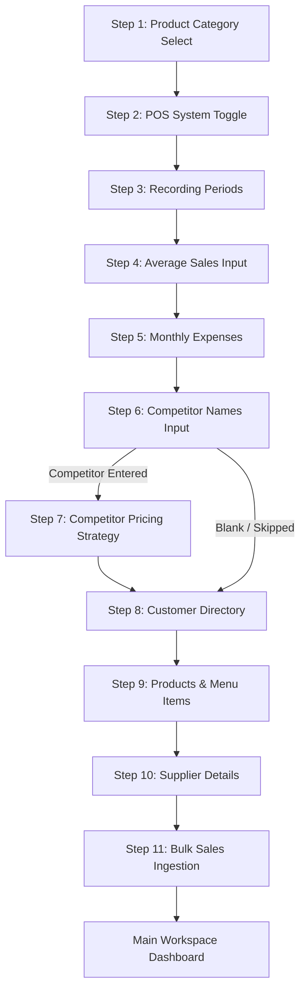

# UI/UX Design System: Data Ingestion & Setup Sandbox

This document outlines the UI/UX architecture for the onboarding, data import, and settings backfill flows of the Strivo Sandbox application. It covers visual aesthetics, step-by-step user flows, and technical integration details.

---

## 1. Design System & Aesthetics (Plum Linen Theme)

The interface is built on a custom design system styled as the **Plum Linen** palette, designed to convey a premium, modern, and warm tactical workspace feel. 

### Harmonious Color System
*   **Background Base (`--bg-base` / `#F8F4F1`)**: A warm linen cream background, replacing standard cold grays/whites.
*   **Surface Cards (`--bg-surface` / `#FFFFFF`)**: Semi-transparent background cards with a backing `backdrop-filter: blur(24px)` glass effect and 1px white border (`rgba(255, 255, 255, 0.6)`) to convey depth.
*   **Accent Brand Color (`--accent` / `#6B2D7B`)**: A deep rich plum color, used for high-importance interactions, progress tracking, and key highlights.
*   **Accent Soft Glow (`--accent-soft` / `rgba(107, 45, 123, 0.12)`)**: Light pastel plum used for active button selections and active drop-zones.
*   **Semantic Accents**:
    *   *Sage Green* (`#5C7B6B`) for positive/active linkages.
    *   *Muted Terracotta* (`#C97755`) for general warnings.
    *   *Muted Rose* (`#A33D5C`) for deletes, warnings, and error indicators.

### Typography
*   **Sans Font**: `Inter` paired with `Noto Sans Myanmar` to handle multilingual toggle support dynamically without layout shifts.
*   **Mono Font**: `JetBrains Mono` for tracking statistics, step indicators, metadata files, and connection keys.
*   **Numbers**: Modern standard numerals (`Roboto`) ensure high legibility of financial statistics.

---

## 2. Onboarding User Flow (The 11-Step Setup)

Instead of a split-pane layout which cluttered smaller laptop screens, the new onboarding adopts a **single-column centered card wizard** (`max-width: 720px`) that immediately boots the user into the Step 1 category select. The initial landing uploader screen and its CSV import option have been completely removed.



### Isolated Setup Steps:
1.  **Product Category Select (Step 1)**: Visual grid cards (Handmade Crafts, Grocery, Coffee, etc.) with custom selection indicators, alongside a manual type-in field.
2.  **POS System Toggle (Step 2)**: Large active cards allowing the user to select whether they track sales digitally (`📊 Yes, I use POS`) or manually (`📝 No, manual ledger`).
3.  **Periodicity Selector (Step 3)**: Checkbox checklist determining which sales recording intervals (Daily, Weekly, Monthly, Yearly) the user utilizes.
4.  **Sales Estimation (Step 4)**: Dynamically rendered input cards matching only the selected periods in Step 3.
5.  **Monthly Expenses (Step 5)**: Input field for average recurring operating overhead (rent, transport, wages, etc.) in **MMK**.
6.  **Competitor Ingest (Step 6)**: Simple comma-separated list of local competing businesses (branches directly to Step 7 if inputs are detected, otherwise skips competitor configuration).
7.  **Competitor Config (Step 7)**: Generates sub-steps for each entered competitor, configuring their primary strategy (e.g., Discount Leader, Premium, Market Matcher).
8.  **Customer List (Step 8 - Skippable)**: Dynamic preview layout allowing manual input of 10-30 customers to feed the AI customer churn models.
9.  **Product & Price Menu (Step 9 - Skippable)**: Form fields to populate the business's key product catalog (requires Name and Price).
10. **Supplier Directory (Step 10 - Skippable)**: Ingests primary supplier names, supplied products, and masked contact details for vendor management.
11. **Bulk Ingestion Invoices (Step 11 - Skippable)**: A drag-and-drop file uploader parsing CSV/Excel files (mocked up to 30 days of sales history) to populate prediction charts.

---

## 3. Bulk Sales File Ingestion UX

> [!IMPORTANT]
> The bulk POS sales file ingestion uploader has been removed from the initial setup screen of the onboarding session. Onboarding now immediately starts with the manual setup questionnaire (Step 1). The bulk sales file uploading is reserved for Step 11 of the questionnaire and the Profile settings modal.

```
+-------------------------------------------------------------+
|               Bulk Sales History Import                     |
|  Upload an Excel or CSV file (up to 30 days) to power AI.   |
|                                                             |
|   +-----------------------------------------------------+   |
|   |                   [ File Ingest Icon ]              |   |
|   |                Drag & Drop Files Here               |   |
|   |                          OR                         |   |
|   |                    [ Select File ]                  |   |
|   |                                                     |   |
|   |                  Supports Excel & CSV               |   |
|   +-----------------------------------------------------+   |
|                                                             |
|   [x] Skip Ingest                                 Next >    |
+-------------------------------------------------------------+
```

### Ingestion Stages (Step 11 / Settings Backfill):
1.  **Awaiting File**: A clean card area featuring dashed borders that react dynamically on hover and file dragging.
2.  **AI Parsing Simulator**: Triggered upon file upload, a progress tracking bar indicates the status (e.g., *AI parsing business context...* -> *Verifying required data points...*) with a clean linear transition.
3.  **Preview Feedback**: A clean preview pane lists the first 5 records parsed (showing Date + Sales Amount in MMK) to reassure the user that the import succeeded.

---

## 4. Settings Backfill Hub ("Add Missing Data" Modal)

To complement the single-business model, users can skip manual steps during onboarding and backfill them later using the **Add Missing Data** modal inside Profile Settings.

### Workspace Shortcut Settings Layout
The Shortcuts grid utilizes a uniform three-column responsive card grid (`repeat(3, 1fr)`) containing:
*   `Customers List` directory modal.
*   `Products List` directory modal.
*   `Suppliers List` directory modal.

### Compact Tabbed Modal UI
The backfill modal utilizes a responsive tab layout that groups skipped configuration steps to prevent layout scrolling issues:

| Tab Option | Purpose | Content Elements |
|---|---|---|
| **Customers** | Client Directories | Add/Delete list showing Name + masked Phone/Email. |
| **Products** | Menu Catalog | Add/Delete list of Products + Prices in MMK. |
| **Suppliers** | Vendor Records | Ingest Supplier + Supplied Items + masked Phone/Email. |
| **Threshold** | Alert Config | Configure minimum stock alerts (triggers low alerts on home dashboard). |
| **Sales History** | Financial backfill | Integrated drag-and-drop CSV/Excel file parser simulation. |

### Masking & Privacy Rules
To protect user and supplier contact details, a dynamic masking filter is applied to Viber/Telegram handles, phone numbers, and email accounts in the preview lists:
*   *Email example*: `johnsmith@example.com` -> `j***@example.com`
*   *Phone example*: `0997123456` -> `***-***-3456`

---

## 5. Multilingual Localization (EN / MM Toggle)

Every single header, description, input placeholder, helper tip, and simulation status supports instantaneous localization. The app holds a single state token (`language` set to `'mm'` or `'en'`), binding all page elements to the locale schema in `translations.js`. All currency formats are locked to **MMK** across both languages to preserve market accuracy.
